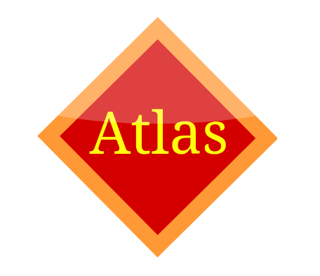

# Atlas32.img

Atlas32.img is a hobby operating system written from scratch in C and x86 Assembly.

Originally created by Zeerak Khan as a learning project, Atlas32.img runs in 32-bit protected mode and includes its own shell, keyboard driver, timer system, speaker support, and RAM-based scripting environment.

---

### Boot System
- Custom x86 BIOS bootloader
- A20 line enabling
- GDT setup
- Switch to 32-bit Protected Mode
- Custom kernel entry point

### Console
- VGA text mode output
- Hardware cursor support
- Screen scrolling
- Clear screen command
- Interactive command shell

### Input
- PS/2 keyboard driver
- Shift key support
- Line editing
- Backspace support

### Timing
- Programmable Interval Timer (PIT)
- Delay commands
- RTC clock access
- Real-time clock command !!(20 Hours off)

### Audio
- PC speaker support
- Tone generation
- Song playback engine

### Scripting System
- RAM-based file editor
- Script storage
- Script execution
- Custom commands:
  - print(text)
  - delay(seconds)

### System Commands
- help
- clear
- about
- time
- reboot
- play song
- create file
- run binary file
- creator

### Creator Command
Displays information about the creator:

- Zeerak Khan
- Started coding at age 6
- Created Atlas32.img at age 9

---

## Commands

### help
Lists all available commands.

### clear
Clears the screen.

### about
Displays operating system information.

### time
Shows the current RTC time.

### reboot
Attempts a hardware reboot.

### play song
Plays a song through the PC speaker.

### create file
Opens the Atlas32.img editor.

### run binary file
Runs the currently saved script.

### creator
Shows information about the creator.

---

## Technical Details

### Language
- C
- x86 Assembly
- very small portion of Python
- Shell scripts and bat scripts
- Linker (.ld)

### Architecture
- x86
- 32-bit Protected Mode

### Video
- VGA Text Mode
- Memory Address: 0xB8000

### Audio
- PC Speaker
- PIT Frequency Generation

### Bootloader
- BIOS Compatible
- NASM Assembly

---

## Project Goals

Current Goals:

- Stable text-mode operating system
- Improved scripting language
- Better command system
- File system support
- Graphics mode support
- BMP image viewer
- Mouse support

Future Goals:

- FAT12/FAT16 support
- Disk file storage
- Windows and menus
- Simple desktop environment
- Networking
- TinyTextOS applications

---

## Author

Zeerak Khan

GitHub:
https://github.com/zeerak587-cloud

Scratch:
https://scratch.mit.edu/users/Cute_Seal_WOW/

---

## Status

Current Version:
Text-Mode Development Branch

Graphics experiments have been temporarily removed while the text kernel is stabilized.

Atlas32 is actively developed and may change frequently.
